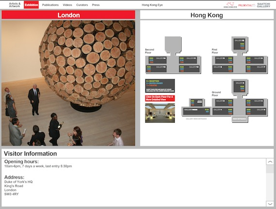
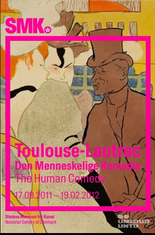

# ios Portfolio
This document contains screenshots of some of my works

## Berlingske Business
**about:** News reader application  
**role:** developer  

 

## Canal+
**technologies:** live streaming, rss  
**role:** part-developer  

 

## Ciklum Mobile Guide
**about:** Enterprise app, providing guidence information to clients, like contacts, places to go, POI, useful numbers  
**role:** team lead, architecture  

 

## ConnEyes
**about:** This is a social network for iPhone. It allows to search another users by their location, type messages to users, create and check in in localities and events, schedule visits, manage complete user profile and more.  
**role:** team lead, architecture  

 

## Delta TV

 

## Ekipazh
**about:** Food buying & delivery app  
**role:** developer  

 

## Energy Intelligence
**about:** Energy news articles reader. Free / Paid content.  
**role:** team lead, architecture, core development, API  

 

## Extrema Outdoor
**about:** Events app  
**technologies:** CAPTIVE login, WISPr  
**role:** developer  

 

## Grazia
**about:** Fashion news reading  
**technologies:** rss, api, caching  
**role:** core development  

 

## HongKongEye
**role:** tech consultancy  

 

## Hummba
**about:** Audio guides on maps, Social network, Media sharing  
**technologies:** audio streaming, security, maps, directions, Social  
**role:** architecture, streaming, social & media parts development  

 

## iccoss
**about:** Super secure media synchronization  
**technologies:** ssl, security, media, streaming  
**role:** architecture, team lead  

 

## index.md

## InfoSuite
**about:** Presentation of complex data analysis  
**technologies:** charts, bars, pies, tables, API  
**role:** team lead, architecture, PM  

 

## Intertop
**about:** Shoes catalog, buying & delivery  
**role:** developer  

 

## Karaoke
**about:** Karaoke PoC  
**role:** team lead, architecture  

 

## KoreanEye
**role:** tech consultancy  

 

## Lilly
**role:** team lead  

 

## Megger
**role:** team lead  

 

## Nordic Startup Awards
**role:** pm, tech consultancy  

 

## OpenStat
**about:** Presenting statistical information  
**role:** network implementation  

 

## Pernod Ricard Annual Report
**role:** team lead  

 

## qCar
**about:** Connecting iOS with car hardware, showing gauges  
**technologies:** hardware development, BT, WiFi, MFi  
**role:** full development  

 

## SMK Toulouse Lautrec
**about:**
Art gallery interactive guide, featuring:
* Audio player (with lyrics)
* Gallery (small and big pictures)
* Video player (with subtitle)
* Calendar with events (json updates time to time)
* Information (Map, Memberships, Contacts)
 
**role:** team lead, architecture  

 

## TheVoice

 

## VouchAR
**about:** The World’s first stand-alone Augmented Reality mobile discount voucher application. VouchAR will find your current location via GPS, hunt for nearby coupons and then display the results on top of video of the real world as seen through the camera on your mobile device.  
**technologies:** augmented reality, mapping  
**role:** tech consultant  

 

## Ziggo TV
**about:** Live streaming, news, EPG  
**role:** news, network, social, EPG developer, performance optimization  

 

