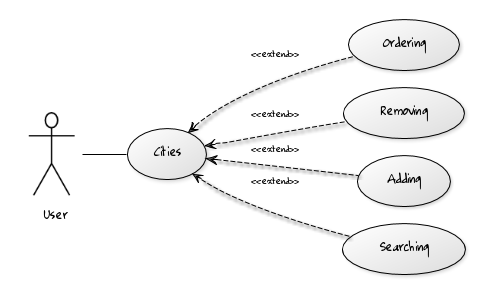
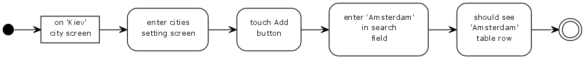
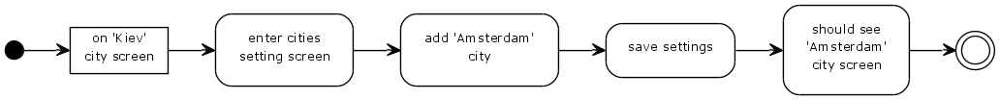
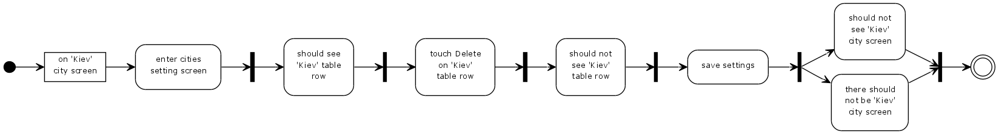
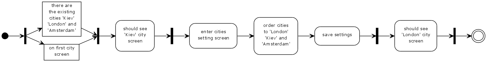
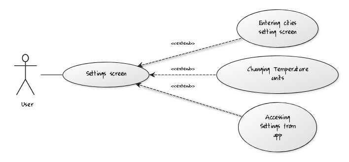
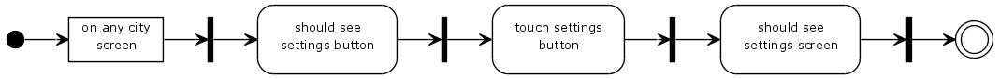
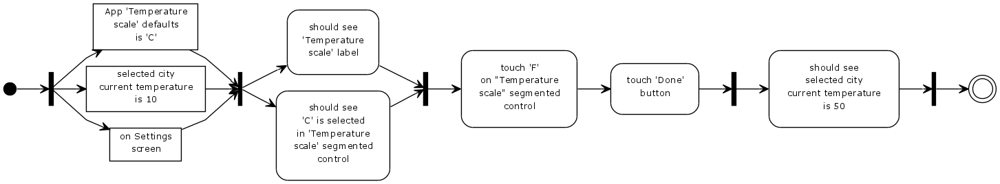
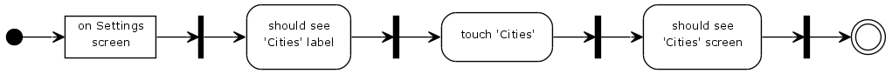
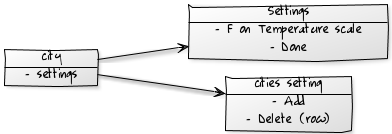

## Idea

Generate diagrams from Gherkin (Cucumber features)

Below this line text is fully generated:

## Features
### Cities


 - **Searching**



 - **Adding**



 - **Removing**



 - **Ordering**



### Settings screen


 - **Accessing Settings from app**



 - **Changing Temperature units**



 - **Entering cities setting screen**



## UI Elements
*Screens and actions*




## Use cases listing

``` gherkin
Feature: Cities
  In order view weather for different cities,
  As a User,
  I want to have ability to manage cities.

  Scenario: Searching
    Given I am on 'Kiev' city screen
     When I enter cities setting screen
      And I touch Add button
      And I enter 'Amsterdam' in search field
     Then I should see 'Amsterdam' table row

  Scenario: Adding
    Given I am on 'Kiev' city screen
     When I enter cities setting screen
      And I add 'Amsterdam' city
      And I save settings
     Then I should see 'Amsterdam' city screen

  Scenario: Removing
    Given I am on 'Kiev' city screen
     When I enter cities setting screen
     Then I should see 'Kiev' table row
     When I touch Delete on 'Kiev' table row
     Then I should not see 'Kiev' table row
     When I save settings
     Then I should not see 'Kiev' city screen
      And there should not be 'Kiev' city screen

  Scenario: Ordering
    Given there are the existing cities 'Kiev', 'London' and 'Amsterdam'
      And I am on first city screen
     Then I should see 'Kiev' city screen
     When I enter cities setting screen
      And I order cities to 'London', 'Kiev' and 'Amsterdam'
      And I save settings
     Then I should see 'London' city screen
```


``` gherkin
Feature: Settings screen
  In order to change app settings,
  As a User,
  I want to have settings screen.

  Scenario: Accessing Settings from app
    Given I am on any city screen
     Then I should see settings button
     When I touch settings button
     Then I should see settings screen

  Scenario: Changing Temperature units
    Given App 'Temperature scale' defaults is 'C'
      And selected city current temperature is 10
      And I am on Settings screen
     Then I should see 'Temperature scale' label
      And I should see 'C' is selected in 'Temperature scale' segmented control
     When I touch 'F' on "Temperature scale" segmented control
      And I touch 'Done' button
     Then I should see selected city current temperature is 50

  Scenario: Entering cities setting screen
    Given I am on Settings screen
     Then I should see 'Cities' label
     When I touch 'Cities'
     Then I should see 'Cities' screen

```
