Title: diagramize it
Author: Taras Kalapun

<!-- # -->
<!--  -->

<!-- # whoami -->

 <!-- // p1 -->

# Types of diagrams

#
## Block diagrams
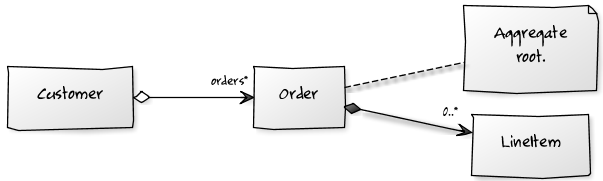

#
## Use Cases
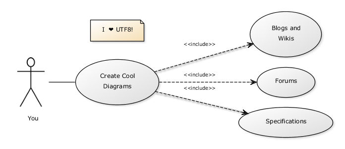

#
## Activity
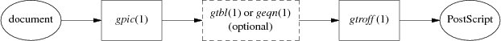

#
## Sequence
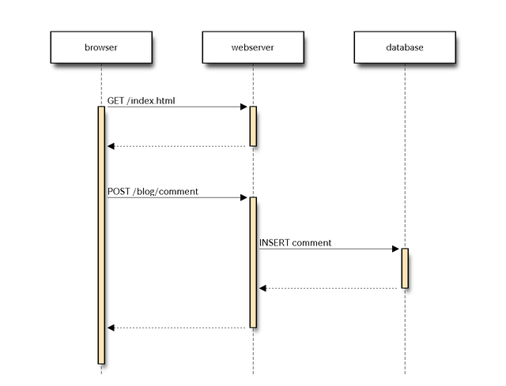

<!-- // p 2 -->

<!-- //Block -->

# Block diagrams

#
## yuml.me

```
[Customer]<>-orders*>[Order]
[Order]++-0..*>[LineItem]
[Order]-[note:Aggregate root.]
```

 


#
## blockdiag

```
blockdiag {
   A -> B -> C -> D;
   A -> E -> F -> G;
}
```

 
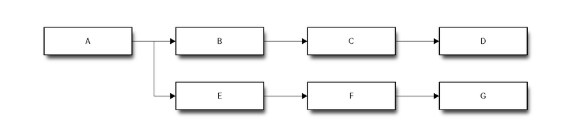

#
## blockdiag

```
blockdiag {
  WeatherApi [shape = ellipse];
  AdMob [shape = ellipse];
  Cloud [shape = cloud];
  User [shape = actor];

  WeatherApi -> Cloud
  AdMob -> Cloud
  Cloud -> App
  App -> User
}
```

 
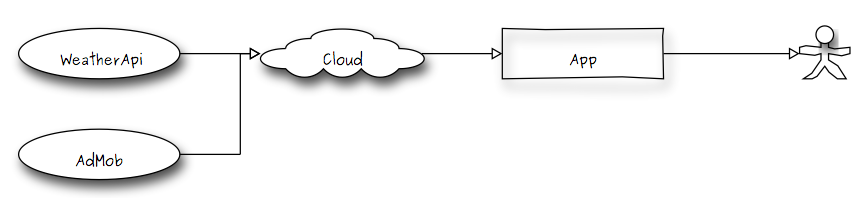

#
## Graphviz


#
## Graphviz

```
digraph G {
    ranksep = 1
    rankdir = TD
    node [
        shape = "record"
        height = 0.50
        fontsize = 10
        margin = 0.20,0.05
    ]
    A2 [
        label = "Customer]"
        style = "filled"
        fillcolor = ""
    ]
    node [
        shape = "record"
        height = 0.50
        fontsize = 10
        margin = 0.20,0.05
    ]
    A48 [
        label = "Order]"
        style = "filled"
        fillcolor = ""
    ]
    edge [
        shape = "edge"
        dir = "both"
        style = "solid"
        arrowtail = "odiamond"
        taillabel = "1"
        arrowhead = "vee"
        headlabel = ">"
        labeldistance = 2
        fontsize = 10
    ]
    A2 -> A48
    node [
        shape = "record"
        height = 0.50
        fontsize = 10
        margin = 0.20,0.05
    ]
    A94 [
        label = "LineItem]"
        style = "filled"
        fillcolor = ""
    ]
    edge [
        shape = "edge"
        dir = "both"
        style = "solid"
        arrowtail = "diamond"
        taillabel = "*"
        arrowhead = "vee"
        headlabel = ">"
        labeldistance = 2
        fontsize = 10
    ]
    A48 -> A94
    node [
        shape = "record"
        height = 0.50
        fontsize = 10
        margin = 0.20,0.05
    ]
    A143 [
        label = "DeliveryMethod]"
        style = "filled"
        fillcolor = ""
    ]
    edge [
        shape = "edge"
        dir = "both"
        style = "solid"
        arrowtail = "none"
        taillabel = ""
        arrowhead = "vee"
        headlabel = ">"
        labeldistance = 2
        fontsize = 10
    ]
    A48 -> A143
    node [
        shape = "record"
        height = 0.50
        fontsize = 10
        margin = 0.20,0.05
    ]
    A199 [
        label = "Product]"
        style = "filled"
        fillcolor = ""
    ]
    edge [
        shape = "edge"
        dir = "both"
        style = "solid"
        arrowtail = "none"
        taillabel = "*"
        arrowhead = "vee"
        headlabel = ">"
        labeldistance = 2
        fontsize = 10
    ]
    A48 -> A199
    node [
        shape = "record"
        height = 0.50
        fontsize = 10
        margin = 0.20,0.05
    ]
    A248 [
        label = "Category"
        style = "filled"
        fillcolor = ""
    ]
    A298 [
        label = "National"
        style = "filled"
        fillcolor = ""
    ]
    A348 [
        label = "International"
        style = "filled"
        fillcolor = ""
    ]
    A143 -> A298 -> A348 -> A248
}
```

 
<!-- //Use Case diagrams -->

# Use Case diagrams

#
## yuml.me

```

 [Customer]-(Make Cup of Tea)
(Make Cup of Tea)<(Add Milk)
(Make Cup of Tea)>(Add Tea Bag)
```

 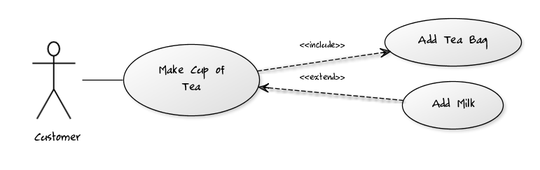

 #
## Graphviz

```
digraph G {
  rankdir=LR;

  subgraph clusterUser {label="User"; labelloc="b"; peripheries=0; user};
  user [shapefile="stick.png", peripheries=0, style=invis];
  login [label="Log In", shape=ellipse];

  user->login [arrowhead=none];
}
```

 
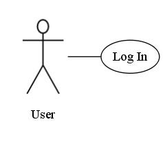

http://martin.elwin.com/blog/2008/05/uml-use-case-diagrams-graphviz/

#
## Graphviz

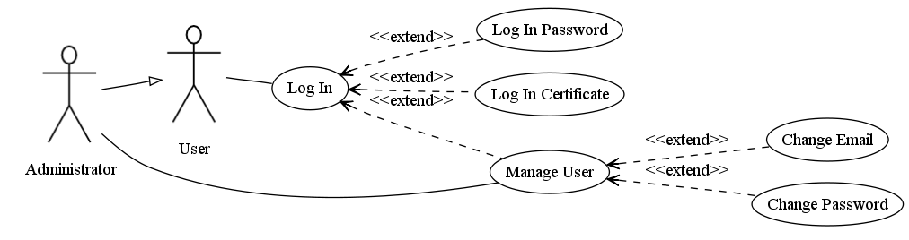

<!-- //Activity diagrams -->

# Activity diagrams

#
## yuml.me

```

 (start)->|a|
|a|->(Make Coffee)->|b|
|a|->(Make Breakfast)->|b|
|b|-><c>[want more coffee]->(Make Coffee)
<c>[satisfied]->(end)
```

 
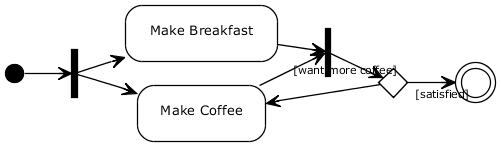

#
## GNU Pic
http://floppsie.comp.glam.ac.uk/Glamorgan/gaius/web/pic.html


```

 .PS
ellipse "document";
arrow;
box "\fIgpic\fP(1)"
arrow;
box width 1.2 "\fIgtbl\/\fP(1) or \fIgeqn\/\fP(1)" "(optional)" dashed;
arrow;
box "\fIgtroff\/\fP(1)";
arrow;
ellipse "PostScript"
.PE
```

 
#
## Graphviz

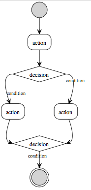
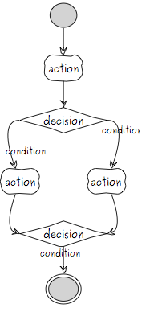

#
## Graphviz
```

 digraph untitled {
  rankdir=TD
  size="4,4"
  edge[fontsize="11" arrowhead=open]
  start[shape=circle, label="", style=filled]
  end[shape=doublecircle, label="", style=filled]
  action1[shape=box,style=rounded, label="action"]
  action2[shape=box,style=rounded, label="action"]
  action3[shape=box,style=rounded, label="action"]
  if1[shape=diamond, label="decision"]
  if2[shape=diamond, label="decision"]

  start -> action1
  action1 -> if1[headport=n]
  if1 -> action2[label="condition" tailport=w]
  if1 -> action3[taillabel="condition" labeldistance=2.5 tailport=e]
  action2 -> if2[headport=w]
  action3 -> if2[headport=e]
  if2 -> end[taillabel="condition"]
}
```

 
#
## actdiag

```

 actdiag {
  write -> convert -> image

  lane user {
     label = "User"
     write [label = "Writing reST"];
     image [label = "Get diagram IMAGE"];
  }
  lane actdiag {
     convert [label = "Convert reST to Image"];
  }
}
```

 
#
## actdiag

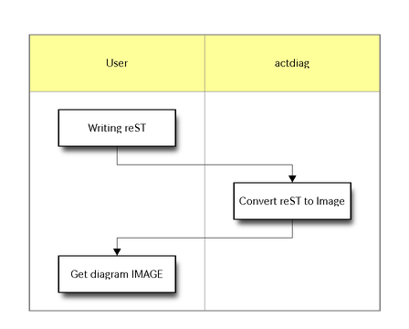

<!-- //Sequence diagrams -->

# Sequence diagrams

#
## WebSequenceDiagrams
http://websequencediagrams.com

```

 A->+B: text
B-->-A: text
A->B: text2
```

 
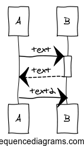

#
## Seqdiag
http://blockdiag.com/en/seqdiag/

```

 seqdiag {
  browser  -> webserver [label = "GET /index.html"];
  browser <-- webserver;
  browser  -> webserver [label = "POST /blog/comment"];
              webserver  -> database [label = "INSERT comment"];
              webserver <-- database;
  browser <-- webserver;
}
```

 #
## Seqdiag


#
## pic2plot
http://projetos.edugraf.ufsc.br/2011/1/convidado/jgzeni/ProjetoFinal/JogoDeCartas/002/bin/src/UMLGraph-5.4/doc/uml-appa.html

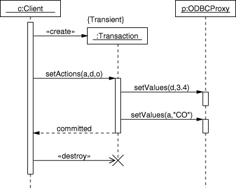

* `brew install plotutils`
* https://github.com/dspinellis/UMLGraph/blob/master/sequence.pic

#
## pic2plot
```

 .PS

copy "sequence.pic";

boxwid = 1.1;
movewid = 0.5;

# Define the objects
object(C,"c:Client");
pobject(T);
object(P,"p:ODBCProxy");

# Message sequences
step();
active(C);
cmessage(C,T,":Transaction");
oconstraint("{Transient}");
step();
message(C,T,"setActions(a,d,o)");
active(T);
message(T,P,"setValues(d,3.4)");
active(P);
step();
inactive(P);
message(T,P,"setValues(a,\"CO\")");
active(P);
rmessage(T,C,"committed");
inactive(T);
inactive(P);
async(); dmessage(C,T);
step();
inactive(C);
step();

complete(C);
complete(P);

.PE
```

 
<!-- //Other cool diagrams -->

# Other cool diagrams

#
## nwdiag
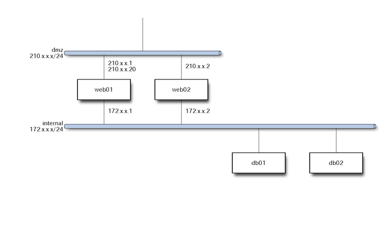

#
## nwdiag

```

 nwdiag {
  network dmz {
      address = "210.x.x.x/24"

      // set multiple addresses (using comma)
      web01 [address = "210.x.x.1, 210.x.x.20"];
      web02 [address = "210.x.x.2"];
  }
  network internal {
      address = "172.x.x.x/24";

      web01 [address = "172.x.x.1"];
      web02 [address = "172.x.x.2"];
      db01;
      db02;
  }
}
```

 #
## rackdiag
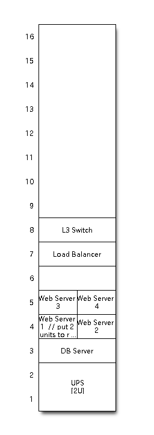

#
## rackdiag

```

 rackdiag {
  // define height of rack
  16U;

  // define rack items
  1: UPS [2U];
  3: DB Server
  4: Web Server 1  // put 2 units to rack-level 4
  4: Web Server 2
  5: Web Server 3
  5: Web Server 4
  7: Load Balancer
  8: L3 Switch
}
```

 
#
## ASCII ditaa
http://ditaa.sourceforge.net

```

     +--------+   +-------+    +-------+
    |        | --+ ditaa +--> |       |
    |  Text  |   +-------+    |diagram|
    |Document|   |!magic!|    |       |
    |     {d}|   |       |    |       |
    +---+----+   +-------+    +-------+
        :                         ^
        |       Lots of work      |
        +-------------------------+
```

 

 #
## Graphviz IC
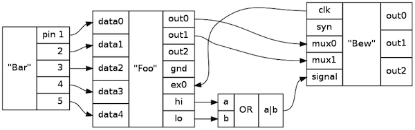

#
## Graphviz IC
```

 digraph G {
    graph [rankdir = LR];

    node[shape=record];
    Bar[label="{ \"Bar\"|{<p1>pin 1|<p2>     2|<p3>     3|<p4>     4|<p5>     5} }"];
    Foo[label="{ {<data0>data0|<data1>data1|<data2>data2|<data3>data3|<data4>data4}|\"Foo\" |{<out0>out0|<out1>out1|<out2>out2|<GND>gnd|<ex0>ex0|<hi>hi|<lo>lo} }"];

    Bew[label="{ {<clk>clk|<syn>syn|<mux0>mux0|<mux1>mux1|<signal>signal}|\"Bew\" |{<out0>out0|<out1>out1|<out2>out2} }"];
    Bar:p1 -> Foo:data0;
    Bar:p2 -> Foo:data1;
    Bar:p3 -> Foo:data2;
    Bar:p4 -> Foo:data3;
    Bar:p5 -> Foo:data4;

    Foo:out0 -> Bew:mux0;
    Foo:out1 -> Bew:mux1;
    Bew:clk -> Foo:ex0;

    Gate[label="{ {<a>a|<b>b}|OR|{<ab>a\|b} }"];

    Foo:hi -> Gate:a;
    Foo:lo -> Gate:b;
    Gate:ab -> Bew:signal;
}
```

 
# THX! <br/> Q?

